  [](https://travis-ci.org/ballerina-guides/ballerina-honeycomb)
  
## Integration with Honeycomb

Honeycomb is a tool used to investigate how well your system works in various conditions (for example - high traffic). Through Honeycomb, you can collect data pertaining to your software that can be broken down into various entities. You can observe the performance of each of these entities specifically.
     
> This guide provides instructions on how Ballerina can be used to integrate with Honeycomb.

The following are the sections available in this guide.

- [What you'll build](#what-you’ll-build)
- [Prerequisites](#prerequisites)
- [Implementation](#implementation)
- [Testing](#testing)
- [Configuration with Honeycomb](#testing-with-honeycomb)
     - [Traces](#views-of-traces)
     - [Metrics](#metrics)

## What you’ll build
To perform this integration with Honeycomb,  a real world use case of a very simple student management system is used.
This system will illustrate the manipulation of student details in a school/college management system. The administrator will be able to perform the following actions in this service.

    - Add a student's details to the system.
    - List down all the students' details who are registered in the system.
    - Delete a student's details from the system by providing student ID.
    - Generate a mock error (for observability purposes).
    - Get a student's marks list by providing student ID.


- **Make Requests** : To perform actions on student  management service, a console based client program has been written in Ballerina for your ease of making requests.

## Prerequisites
 
- [Ballerina Distribution](https://ballerina.io/learn/getting-started/)
- [Docker](https://docs.docker.com/engine/installation/)
- [MySQL](https://github.com/ballerina-guides/ballerina-honeycomb/blob/master/resources/testdb.sql)
- A Text Editor or an IDE 

## Implementation

> If you want to skip the basics, you can download the GitHub repo and continue from the [Testing](#testing) section.

### Implementing the database
 - Start MySQL server in your local machine.
 - Create a database with name `testdb` in your MySQL localhost. If you want to skip the database implementation, then directly import the [testdb.sql](https://github.com/ballerina-guides/ballerina-honeycomb/blob/master/resources/testdb.sql) file into your localhost. You can find it in the Github repo.
### Create the project structure
        
 For the purpose of this guide, let's use the following package structure.
        
    
    ballerina-honeycomb
           └── guide
                ├── students
                │   ├── student_management_service.bal
                │   ├── student_marks_management_service.bal
                ├── client_service
                |         └── client_main.bal
                └── ballerina.conf
        

- Create the above directories in your local machine, along with the empty `.bal` files.

- Add the following lines in your [ballerina.conf](https://github.com/ballerina-guides/ballerina-honeycomb/blob/master/ballerina.conf) to send the service traces to Honeycomb in Zipkin format using Opentracing.

```ballerina
[b7a.observability.tracing]
enabled=true
name="zipkin"

[b7a.observability.tracing.zipkin]
reporter.hostname="localhost"
reporter.port=9411

# Send the spans in V1 format as honeycomb-opentracing-proxy supports on V1
reporter.api.context="/api/v1/spans"
reporter.api.version="v1"


reporter.compression.enabled=false
```

- Open the terminal, navigate to `ballerina-honeycomb/guide`, and run Ballerina project initializing toolkit.

``
   $ ballerina init
``
- Clone and build the ballerina-zipkin-extension in the following repository [https://github.com/ballerina-platform/ballerina-observability/tree/master/tracing-extensions/modules.](https://github.com/ballerina-platform/ballerina-observability/tree/master/tracing-extensions/modules) 

- After building  move to `ballerina-zipkin-extension>/target/distribution/` and copy all the jar files to your `bre/lib` folder in your Ballerina distribution.

### Development of student management and marks management services with Honeycomb

Now let us look into the implementation of the student management with observability.

##### student_management_service.bal

``` ballerina
// Copyright (c) 2018 WSO2 Inc. (http://www.wso2.org) All Rights Reserved.
//
// WSO2 Inc. licenses this file to you under the Apache License,
// Version 2.0 (the "License"); you may not use this file except
// in compliance with the License.
// You may obtain a copy of the License at
//
// http://www.apache.org/licenses/LICENSE-2.0
//
// Unless required by applicable law or agreed to in writing,
// software distributed under the License is distributed on an
// "AS IS" BASIS, WITHOUT WARRANTIES OR CONDITIONS OF ANY
// KIND, either express or implied.  See the License for the
// specific language governing permissions and limitations
// under the License.

import ballerina/http;
import ballerina/io;
import ballerina/log;
import ballerina/mysql;
import ballerina/observe;
import ballerina/runtime;

// Type Student is created to store details of a student.
type Student record {
    int id;
    int age;
    string name;
    int mobNo;
    string address;
};

// Endpoint for marks details client.
endpoint http:Client marksServiceEP {
    url: " http://localhost:9191"
};

// Endpoint for MySQL client.
public endpoint mysql:Client databaseEP {
    host: "localhost",
    port: 3306,
    name: "testdb",
    username: "root",
    password: "",
    poolOptions: { maximumPoolSize: 5 },
    dbOptions: { useSSL: false }
};

// This service listener.
endpoint http:Listener studentServiceListener {
    port: 9292
};

// Student data service.
@http:ServiceConfig {
    basePath: "/records"
}
service<http:Service> StudentData bind studentServiceListener {

    int errors = 0;
    int requestCounts = 0;

    @http:ResourceConfig {
        methods: ["POST"],
        path: "/addStudent"
    }
    // Add Students resource used to add student records to the system.
    addStudents(endpoint httpConnection, http:Request request) {
        // Initialize an empty HTTP response message.
        requestCounts++;
        http:Response response;

        // Accepting the JSON payload sent from a request.
        json payloadJson = check request.getJsonPayload();

        //Converting the payload to Student type.
        Student studentDetails = check <Student>payloadJson;

        // Calling the function insertData to update database.
        json returnValue = insertData (studentDetails.name, studentDetails.age, studentDetails.mobNo, studentDetails.address);

        // Send the response back to the client with the returned JSON value from insertData function.
        response.setJsonPayload(returnValue);
        _ = httpConnection->respond(response) but { error e => log:printError("Error sending response", err = e)};

        // The below function adds tags that are to be passed as metrics in the traces. These tags are added to the default ootb system span.
        _ = observe:addTagToSpan("tot_requests", <string>requestCounts);
        _ = observe:addTagToSpan("error_counts", <string>errors);
    }

    @http:ResourceConfig {
        methods: ["POST"],
        path: "/viewAll"
    }
    // View students resource is to get all the students details and send to the requested user.
    viewStudents(endpoint httpConnection, http:Request request) {
        requestCounts++;
        int childSpanId = check observe:startSpan("Obtain details span");
        http:Response response;
        json status = {};

        int spanId2 = observe:startRootSpan("Database call span");
        var returnValue = databaseEP->select("SELECT * FROM student", Student, loadToMemory = true);
        //Sending a request to MySQL endpoint and getting a response with required data table.
        _ = observe:finishSpan(spanId2);
        // A table is declared with Student as its type.
        table<Student> dataTable;

        // Match operator used to check if the response returned value with one of the types below.
        match returnValue {
            table tableReturned => dataTable = tableReturned;
            error e => io:println("Select data from student table failed: "
                    + e.message);
        }

        // Student details displayed on server side for reference purpose.
        foreach row in dataTable {
            io:println("Student:" + row.id + "|" + row.name + "|" + row.age);
        }

        // Table is converted to JSON.
        var jsonConversionValue = <json>dataTable;
        match jsonConversionValue {
            json jsonResult => {
                status = jsonResult;
            }
            error e => {
                status = { "Status": "Data Not available", "Error": e.message };
            }
        }
        // Sending back the converted JSON data to the request made to this service.
        response.setJsonPayload(untaint status);
        _ = httpConnection->respond(response) but { error e => log:printError("Error sending response", err = e) };

        _ = observe:finishSpan(childSpanId);
        // The below function adds tags that are to be passed as metrics in the traces. These tags are added to the default ootb system span.
        _ = observe:addTagToSpan("tot_requests", <string>requestCounts);
        _ = observe:addTagToSpan("error_counts", <string>errors);

    }

    @http:ResourceConfig {
        methods: ["GET"],
        path: "/testError"
    }
    // Test Error resource to make a mock error.
    testError(endpoint httpConnection, http:Request request) {
        requestCounts++;
        http:Response response;

        errors++;
        io:println(errors);
        // The below function adds tags that are to be passed as metrics in the traces. These tags are added to the default ootb system span.
        _ = observe:addTagToSpan("error_counts", <string>errors);
        _ = observe:addTagToSpan("tot_requests", <string>requestCounts);
        log:printError("error test");
        response.setTextPayload("Test Error made");
        _ = httpConnection->respond(response) but { error e => log:printError("Error sending response", err = e) };
    }

    @http:ResourceConfig {
        methods: ["GET"],
        path: "/deleteStu/{stuId}"
    }
    // Delete Students resource for deleteing a student using id.
    deleteStudent(endpoint httpConnection, http:Request request, int stuId) {
        requestCounts++;
        http:Response response;
        json status = {};

        // Calling deleteData function with id as parameter and get a return json object.
        var returnValue = deleteData(stuId);
        io:println(returnValue);

        // Pass the obtained JSON object to the request.
        response.setJsonPayload(returnValue);
        _ = httpConnection->respond(response) but { error e => log:printError("Error sending response", err = e) };
        // The below function adds tags that are to be passed as metrics in the traces. These tags are added to the default ootb system span.
        _ = observe:addTagToSpan("tot_requests", <string>requestCounts);
        _ = observe:addTagToSpan("error_counts", <string>errors);
    }

    @http:ResourceConfig {
        methods: ["GET"],
        path: "/getMarks/{stuId}"
    }
    // Get marks resource for obtaining marks of a particular student.
    getMarks(endpoint httpConnection, http:Request request, int stuId) {
        requestCounts++;
        http:Response response;
        json result;

        // Self defined span for observability purposes.
        int firstSpan = check observe:startSpan("First span");
        // Request made for obtaining marks of the student with the respective stuId to marks Service.
        var requestReturn = marksServiceEP->get("/marks/getMarks/" + untaint stuId);

        match requestReturn{
            http:Response response2 => {
                var msg = response2.getJsonPayload();
                // Gets the JSON object.
                match msg {
                    json jsonObj => {
                        result = jsonObj;
                    }

                    error er => {
                        log:printError(er.message, err = er);
                    }
                }
            }
            error err => {
                log:printError(err.message, err = err);
            }
        }
        // Stopping the previously started span.
        _ = observe:finishSpan(firstSpan);
        //Sending the JSON to the client.
        response.setJsonPayload(untaint result);
        _ = httpConnection->respond(response) but { error e => log:printError("Error sending response", err = e) };

        //  The below function adds tags that are to be passed as metrics in the traces. These tags are added to the default ootb system span.
        _ = observe:addTagToSpan("tot_requests", <string>requestCounts);
        _ = observe:addTagToSpan("error_counts", <string>errors);
    }
}

// Function to insert values to database.
  # `insertData()` is a function to add data to student records database.
  #
  # + name - This is the name of the student to be added.
  # + age -Student age.
  # + mobNo -Student mobile number.
  # + address - Student address.
  # + return - This function returns a JSON object. If data is added it returns JSON containing a status and id of student added.
  #          If data is not added , it returns the JSON containing a status and error message.

public function insertData(string name, int age, int mobNo, string address) returns (json) {
    json updateStatus;
    int uid;
    string sqlString = "INSERT INTO student (name, age, mobNo, address) VALUES (?,?,?,?)";
    // Insert data to SQL database by invoking update action.
    var returnValue = databaseEP->update(sqlString, name, age, mobNo, address);

    // Use match operator to check the validity of the result from database.
    match returnValue {
        int updateRowCount => {
         var result = getId(untaint mobNo);
            // Getting info of the student added
            match result {
                table dataTable => {
                    while (dataTable.hasNext()) {
                        var returnValue2 = <Student>dataTable.getNext();
                        match returnValue2 {
                            // Getting the  id of the latest student added.
                            Student student => uid = student.id;
                            error e => io:println("Error in get employee from table: " + e.message);
                        }
                    }
                }
                error er => {
                    log:printError(er.message,err = er);
                }
            }
            updateStatus = { "Status": "Data Inserted Successfully", "id": uid };
        }
        error err => {
            updateStatus = { "Status": "Data Not Inserted", "Error": err.message };
        }
    }
    return updateStatus;
}

// Function to delete student data from database.
  # `deleteData()` is a function to delete a student's data from student records database.
  #
  # + stuId - This is the id of the student to be deleted.
  # + return -This function returns a JSON object. If data is deleted it returns JSON containing a status.
  #           If data is not deleted , it returns the JSON containing a status and error message.

public function deleteData(int stuId) returns (json) {
    json status = {};
    string sqlString = "DELETE FROM student WHERE id = ?";

    // Delete existing data by invoking update action.
    var returnValue = databaseEP->update(sqlString, stuId);
    io:println(returnValue);
    match returnValue {
        int updateRowCount => {
            if (updateRowCount != 1){
                status = { "Status": "Data Not Found" };
            }
            else {
                status = { "Status": "Data Deleted Successfully" };
            }
        }
        error err => {
            status = { "Status": "Data Not Deleted", "Error": err.message };
            log:printError(err.message,err = err);
        }
    }
    return status;
}

# `getId()` is a function to get the Id of the student added in latest.
#
# + mobNo - This is the mobile number of the student added which is passed as parameter to build up the query.
# + return -This function returns either a table which has only one row of the student details or an error.

// Function to get the generated Id of the student recently added.
public function getId(int mobNo) returns table|error {
    //Select data from database by invoking select action.
    var returnValue = databaseEP->select("Select * FROM student WHERE mobNo = " + mobNo, Student, loadToMemory = true);
    table<Student> dataTable;
    match returnValue {
        table tableReturned => dataTable = tableReturned;
        error e => io:println("Select data from student table failed: " + e.message);
    }
    return dataTable;
}


```

Now we will look into the implementation of obtaining the marks of the students from database through another service.


##### student_marks_management_service.bal

``` ballerina
// Copyright (c) 2018 WSO2 Inc. (http://www.wso2.org) All Rights Reserved.
//
// WSO2 Inc. licenses this file to you under the Apache License,
// Version 2.0 (the "License"); you may not use this file except
// in compliance with the License.
// You may obtain a copy of the License at
//
// http://www.apache.org/licenses/LICENSE-2.0
//
// Unless required by applicable law or agreed to in writing,
// software distributed under the License is distributed on an
// "AS IS" BASIS, WITHOUT WARRANTIES OR CONDITIONS OF ANY
// KIND, either express or implied.  See the License for the
// specific language governing permissions and limitations
// under the License.

import ballerina/http;
import ballerina/io;
import ballerina/log;
import ballerina/mysql;
import ballerina/observe;
import ballerina/runtime;

type Marks record {
    int studentId;
    int maths;
    int english;
    int science;
};

// This service listener.
endpoint http:Listener marksServiceListener{
    port: 9191
};

// Marks data service.
@http:ServiceConfig {
    basePath: "/marks"
}
service<http:Service> MarksData bind marksServiceListener {
    @http:ResourceConfig {
        methods:["GET"],
        path: "/getMarks/{stuId}"
    }
    // Get marks resource used to get student's marks.
    getMarks(endpoint httpConnection, http:Request request, int stuId) {
        http:Response response = new;
        json result = findMarks(untaint stuId);
        // Pass the obtained JSON object to the requested client.
        response.setJsonPayload(untaint result);
        _ = httpConnection->respond(response) but { error e => log:printError("Error sending response", err = e) };
    }
}

 # `findMarks()`is a function to find a student's marks from the marks record database.
 #
 #  + stuId -  This is the id of the student.
 # + return - This function returns a JSON object. If data is added it returns JSON containing a status and id of student added.
 #            If data is not added , it returns the JSON containing a status and error message.

public function findMarks(int stuId) returns (json) {
    json status = {};
    string sqlString = "SELECT * FROM marks WHERE student_Id = " + stuId;
    // Getting student marks of the given ID.
    // Invoking select operation in testDB.
    var returnValue = databaseEP->select(sqlString, Marks, loadToMemory = true);

    // Assigning data obtained from db to a table.
    table<Marks> dataTable;
    match returnValue {
        table tableReturned => dataTable = tableReturned;
        error err => {
            log:printError(err.message,err= err);
            status = { "Status": "Select data from student table failed: ", "Error": err.message };
            return status;
        }
    }
    // Converting the obtained data in table format to JSON data.
    var jsonConversionValue = <json>dataTable;
    match jsonConversionValue {
        json jsonResult => {
            status = jsonResult;
        }
        error err => {
            status = { "Status": "Data Not available", "Error": err.message };
            log:printError(err.message,err = err);
        }
    }
    io:println(status);
    return status;
}

```

Lets look into the implementation of the client implementation.

##### client_main.bal

``` ballerina
// Copyright (c) 2018 WSO2 Inc. (http://www.wso2.org) All Rights Reserved.
//
// WSO2 Inc. licenses this file to you under the Apache License,
// Version 2.0 (the "License"); you may not use this file except
// in compliance with the License.
// You may obtain a copy of the License at
//
// http://www.apache.org/licenses/LICENSE-2.0
//
// Unless required by applicable law or agreed to in writing,
// software distributed under the License is distributed on an
// "AS IS" BASIS, WITHOUT WARRANTIES OR CONDITIONS OF ANY
// KIND, either express or implied.  See the License for the
// specific language governing permissions and limitations
// under the License.

import ballerina/http;
import ballerina/io;
import ballerina/log;

endpoint http:Client studentData {
    url: " http://localhost:9292"
};

public function main() {
    http:Request req = new;
    int operation = 0;
    while (operation != 6) {
        // Print options menu to choose from.
        io:println("Select operation.");
        io:println("1. Add student");
        io:println("2. View all students");
        io:println("3. Delete a student");
        io:println("4. Make a mock error");
        io:println("5: Get a student's marks");
        io:println("6. Exit \n");

        // Read user's choice.
        string choice = io:readln("Enter choice 1 - 5: ");
        if (!isInteger(choice)) {
            io:println("Choice must be of a number");
            io:println();
            continue;
        }
        operation = check <int>choice;
        // Program runs until the user inputs 6 to terminate the process.
        if (operation == 6) {
            break;
        }
        if (operation == 1) {
            // User chooses to add a student.
            addStudent(req);
        }  else if (operation == 2) {
            // User chooses to list down all the students.
            viewAllStudents();
        } else if (operation == 3) {
            // User chooses to delete a student by Id.
            deleteStudent();
        } else if (operation == 4) {
            // User chooses to make a mock error.
            makeError();
        } else if (operation == 5){
            // User chooses to get the marks of a particular student.
          getMarks();
        } else {
            io:println("Invalid choice \n");
        }
    }
}

function isInteger(string input) returns boolean {
    string regEx = "\\d+";
    boolean isInt = check input.matches(regEx);
    return isInt;
}

function addStudent(http:Request req) {
    // Get student name, age mobile number, address.
    var name = io:readln("Enter Student name: ");
    var age = io:readln("Enter Student age: ");
    var mobile = io:readln("Enter mobile number: ");
    var add = io:readln("Enter Student address: ");

    // Create the request as JSON message.
    json jsonMsg = { "name": name, "age": check <int>age, "mobNo": check <int>mobile, "address": add };
    req.setJsonPayload(jsonMsg);

    // Send the request to students service and get the response from it.
    var resp = studentData->post("/records/addStudent", req);
    match resp {
        http:Response response => {
            var msg = response.getJsonPayload();
            //obtaining the result from the response received
            match msg {
                json jsonPL => {
                    string message = "Status: " + jsonPL["Status"] .toString() + " Added Student Id :- " +
                        jsonPL["id"].toString();
                    // Extracting data from JSON received and displaying.
                    io:println(message);
                }

                error err => {
                    log:printError(err.message, err = err);
                }
            }
        }
        error err => {
            log:printError(err.message, err = err);
        }
    }
}

function viewAllStudents() {
    // Sending a request to list down all students and get the response from it.
    var request = studentData->post("/records/viewAll", null);
    match request {
        http:Response response => {
            var msg = response.getJsonPayload();
            // Obtaining the result from the response received.
            match msg {
                json jsonPL => {
                    string message;
                    // Validate to check if records are available.
                    if (lengthof jsonPL >= 1) {
                        int i;
                        // Loop through the received JSON array and display data.
                        while (i < lengthof jsonPL) {
                            message = "Student Name: " + jsonPL[i]["name"] .toString() + ", " + " Student Age: " + jsonPL[i]["age"] .toString();
                            io:println(message);
                            i++;
                        }
                    } else {
                        // Notify user if no records are available.
                        message = "\n Student record is empty";
                        io:println(message);
                    }
                }
                error err => {
                    log:printError(err.message, err = err);
                }
            }
        }
        error err => {
            log:printError(err.message, err = err);
        }
    }
}

function deleteStudent() {
    // Get student id.
    var id = io:readln("Enter student id: ");
    // Request made to find the student with the given id and get the response from it.
    var request = studentData->get("/records/deleteStu/" + check <int>id);
    match request {
        http:Response response => {
            var msg = response.getJsonPayload();
            // Obtaining the result from the response received.
            match msg {
                json jsonPL => {
                    string message = jsonPL["Status"].toString();
                    io:println("\n"+ message + "\n");
                }
                error err => {
                    log:printError(err.message, err = err);
                }
            }
        }
        error er => {
            log:printError(er.message, err = er);
        }
    }
}

function makeError() {
    var request = studentData->get("/records/testError");
    match request {
        http:Response response => {
            var msg = response.getTextPayload();
            // Obtaining the result from the response received.
            match msg {
                string message => {
                    io:println("\n"+ message + "\n");
                }
                error err => {
                    log:printError(err.message, err = err);
                }
            }
        }
        error er => {
            log:printError(er.message, err = er);
        }
    }
}

function getMarks() {
    // Get student id.
    var id = io:readln("Enter student id: ");
    // Request made to get the marks of the student with given id and get the response from it.
    var request = studentData->get("/records/getMarks/" + check <int>id);
    match request {
        http:Response response => {
            var msg = response.getJsonPayload();
            // Obtaining the result from the response received.
            match msg {
                json jsonPL => {
                    string message;
                    if (lengthof jsonPL >= 1) {
                        // Validate to check if student with given ID exist in the system.
                        message = "Maths: " + jsonPL[0]["maths"] .toString() + " English: " + jsonPL[0]["english"] .toString() + " Science: " + jsonPL[0]["science"] .toString();
                    }
                    else {
                        message = "Data not available. Check if student's mark is added or student might not be in our system.";
                    }
                    io:println("\n"+ message + "\n");
                }
                error err => {
                    log:printError(err.message, err = err);
                }
            }
        }
        error err => {
            log:printError(err.message, err = err);
        }
    }
}
```

- Now we have completed the implementation of student management service with marks management service.


## Testing 

### Invoking the student management service

You can start both the services by opening a terminal and navigating to `ballerina-honeycomb/guide`, and execute the following command.

```
$ ballerina run --config <path-to-conf>/ballerina.conf students
```

 You need to start the honeycomb-opentracing-proxy. This can be done by using docker. Docker is used to pull the image for honeycomb-opentracing-proxy.
 Run the following command.
 
 ```
 docker run -p 9411:9411 honeycombio/honeycomb-opentracing-proxy -k APIKEY -d traces
```
- -k represent the API KEY you will be getting when you sign in to honeycomb account.

- -d represents the dataset you are going to send your trace data to.

 You can observe the service performance by making some HTTP requests to the above services. This is made easy for you as 
 there is a client program implemented. You can start the client program by opening another terminal and navigating to ballerina-honeycomb/guide
 and run the below command
 
 ```
 $ ballerina run client_service
 ``` 
 
### Testing with Honeycomb
 
#### Views of traces
 After making http request, go to [Honeycomb website](https://honeycomb.io) then move to your dataset.

   When you are in your dataset in Honeycomb UI you get to see a button called `New query`, and when you click on that 
   you can write your own queries on the metrics that you have received.
 - You are expected to see the traces as below when you include traceId in the breakdown category.
 
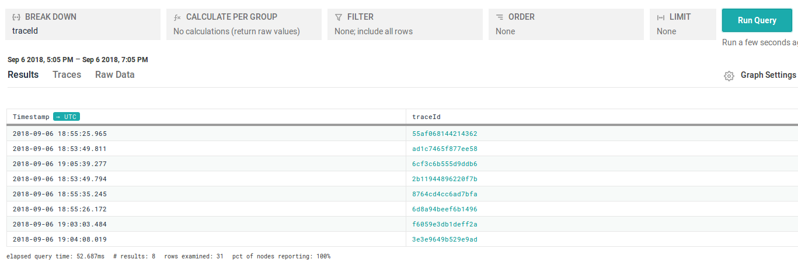
 
 - To view a particular trace click on the traceId column. And you will see as below
 
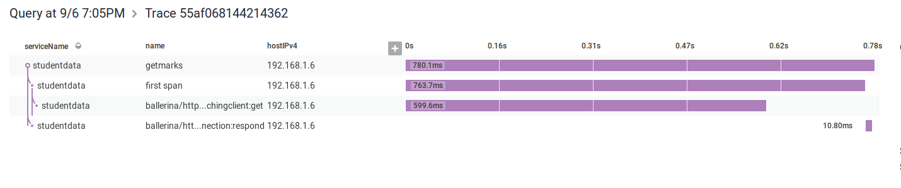
    
 - To view span details with metrics click on a particular span and you are expected to see as below
 

     
     
#### Metrics
     
  You can perform some detailed queries in order to look deep in the performance of your services. Here are some examples:-
  
  - [Total requests](#total-requests)
  - [Resources with high response time](#resources-with-high-response-time)
  - [Counts of database manipulations](#counts-of-database-manipulations)
  - [Mostly hit resources](#mostly-hit-resources)
  - [Average response time](#average-response-time)
  - [Error detection](#error-detection)
  - [Percentiles of response duration](#percentiles-of-response-duration)
  - [Last 1 minute summary](#last-1-minute-summary)
  - [Last 5 minutes summary](#last-5-minutes-summary)
  - [Last 1 hour summary](#last-1-hour-summary) 
  
##### Total requests
   
###### Per resource 
   This will include self defined spans as well
   
            
            Query parameters use for each category:-
            
                          1. BREAK DOWN - name
                          2. CALCULATE PER GROUP - COUNT_DISTINCT(traceId)
                          3. FILTER - name does-not-start-with ballerina/ 
                          
            
         We filter out the other default ballerina resource using the filter query.
         
 
    
   The result of the above query is as below : -
 
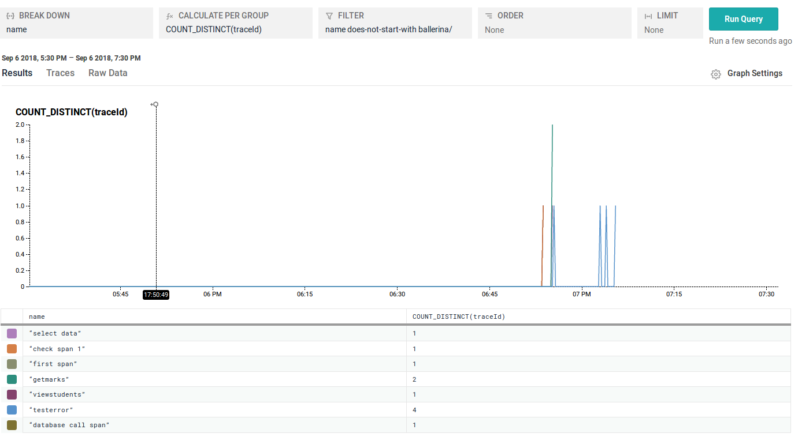
   
   
###### Per service 
      
               
               Query parameters use for each category:-
               
                            1. BREAK DOWN - serviceName 
                            2. CALCULATE PER GROUP - COUNT_DISTINCT(traceId)
                            3. FILTER - name does-not-start-with ballerina/ 
                            4. LIMIT - 100
                            
                 We filter out the other default ballerina resource using the filter query.
            
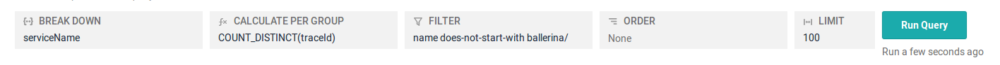
       
   The result of the above query is as below : -
    
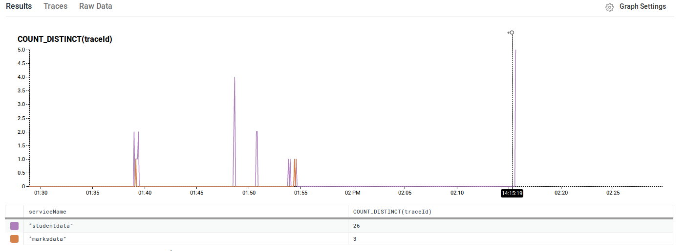
      
   
#### Resources with high response time 
   This will include self defined spans as well.
   
                Query parameters use for each category:-

                         1. BREAK DOWN - name
                         2. CALCULATE PER GROUP - MAX(durationMs)
                         3. FILTER - name does-not-start-with ballerina/
                         4. ORDER - MAX(durationMs) desc
                         5. LIMIT - 100
                         
                    We filter out the other default ballerina resource using the filter query.      
                         
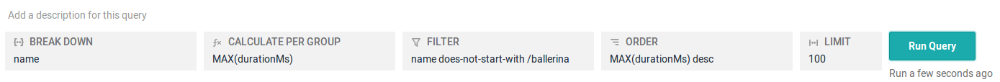
                 
   The result of the above query is as follows : -
      
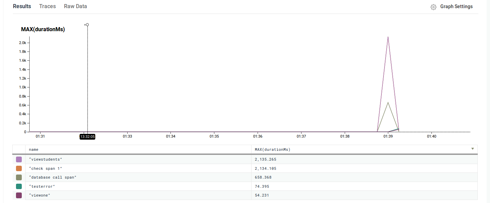
   
   
#### Counts of database manipulations

      
                Query parameters use for each category:-
                
                            1. BREAK DOWN - name
                            2. CALCULATE PER GROUP - COUNT
                            3. FILTER - db.instance = testdb
                            4. ORDER - COUNT desc
                            5. LIMIT - 100     
                            
                     
                    
   The result of the above query is as follows : -
         
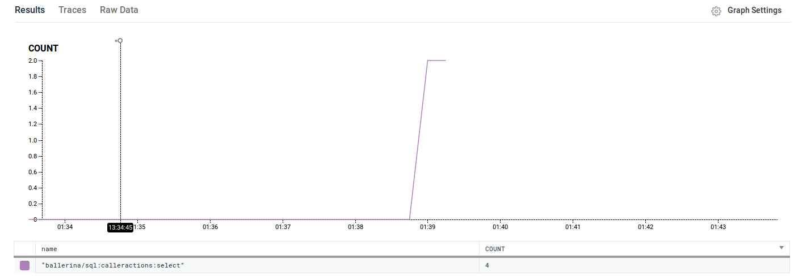
   
   
#### Mostly hit resources 
   This will include self defined spans as well.
              
                Query parameters use for each category:-
            
                           1. BREAK DOWN - name
                           2. CALCULATE PER GROUP - COUNT_DISTINCT(traceId)
                           3. FILTER - name does-not-start-with ballerina/
                           4. ORDER - COUNT_DISTINCT(traceId) desc
                           5. LIMIT - 100
                           
                           
                  We filter out the other default ballerina resource using the filter query.
                                
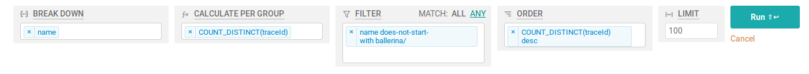
                    
   The result of the above query is as follows : -
         
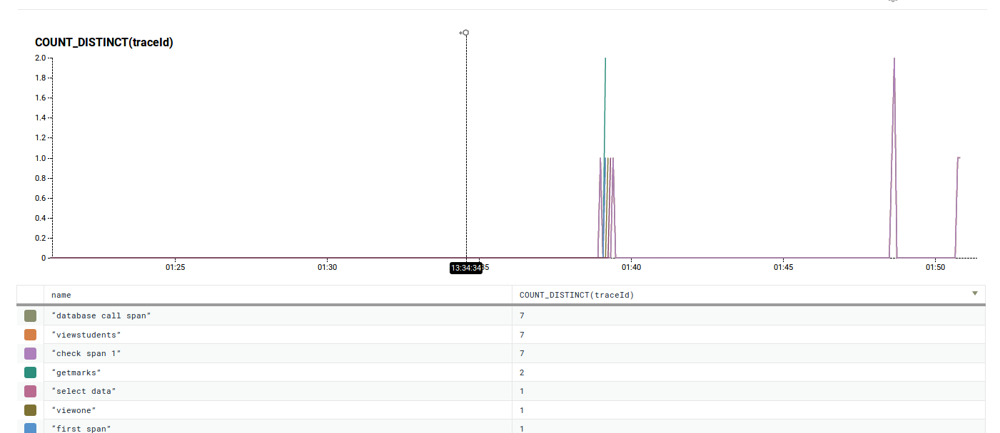
   
   
   
#### Average response time
   
###### Per service
  
                Query parameters use for each category:-
                    
                           1. BREAK DOWN - serviceName
                           2. CALCULATE PER GROUP - AVG(durationMs)
                           3. LIMIT - 100
  
  
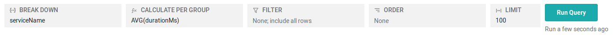
                      
   The result of the above query is as follows : -
         
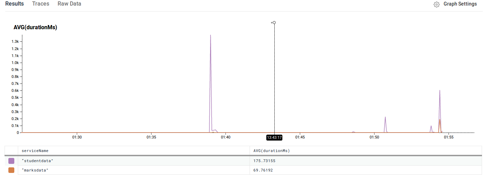
   
   
###### Per resource
   >This will include self defined spans as well.
               
               Query parameters use for each category:-
               
                           1. BREAK DOWN - name
                           2. CALCULATE PER GROUP - AVG(durationMs)
                           3. FILTER - name does-not-start-with ballerina/
                           4. LIMIT - 100
                           
                       We filter out the other default ballerina resource using the filter query.
                       
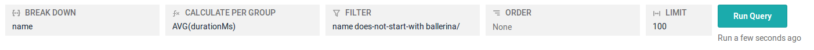
                        
   The result of the above query is as follows : -
             
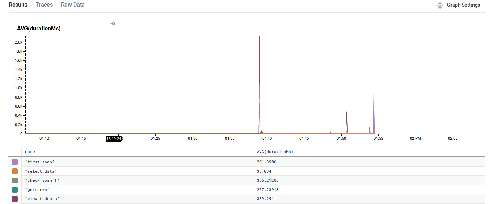 
   
   
#### Error detection
   
                 Query parameters use for each category:- 
  
                            1. CALCULATE PER GROUP - COUNT_DISTINCT(error_counts)
                            
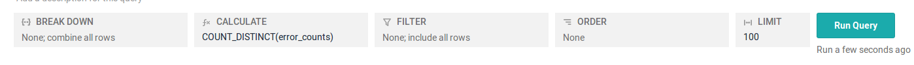
                          
  The result of the above query is as follows : -
               
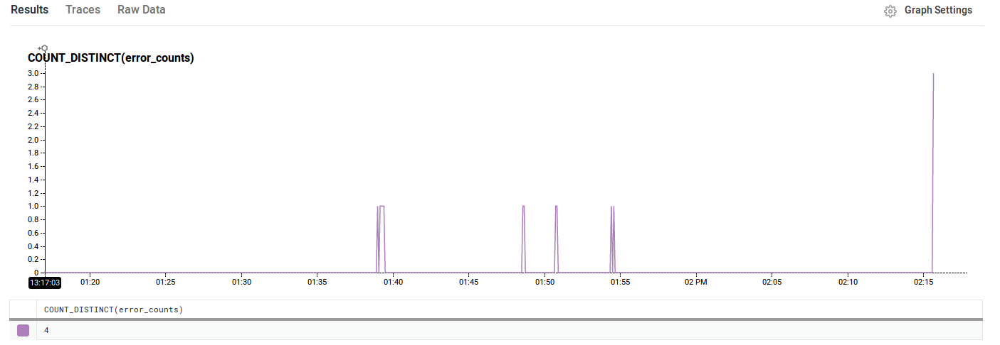 
  
  
  
#### Percentiles of response duration
  
###### Per service
  
                 Query parameters use for each category:-
                   
                            1. BREAK DOWN - serviceName 
                            2. CALCULATE PER GROUP - P75(durationMs),P50(durationMs), P25(durationMs)

                           
   The result of the above query is as follows : -
                
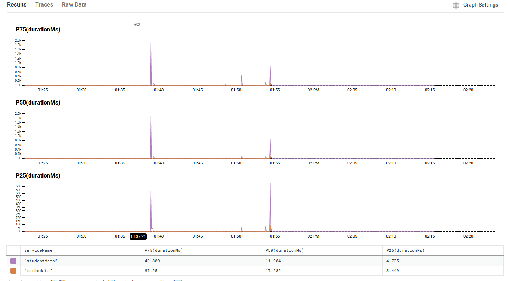 
   
   
#### Last 1 minute summary
      
###### Per service
      
   To find the total request count per service with average response time for the last 1 minute :-
   
   >Duration can be set on the top right corner of the query builder. You can customize the 
   time period within which you wanted to get the metrics.
      
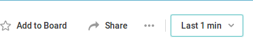
   
   By the drop down menu you can customize the time period.
          
                 Query parameters use for each category:-
                 
                        1. BREAK DOWN - serviceName
                        2. CALCULATE PER GROUP - AVG(durationMs), COUNT_DISTINCT(traceId)
                        3. FILTER - name does-not-start-with ballerina/     
                 
                    We filter out the other default ballerina resource using the filter query.
                             
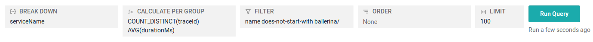
                           
   The result of the above query is as follows : -
                
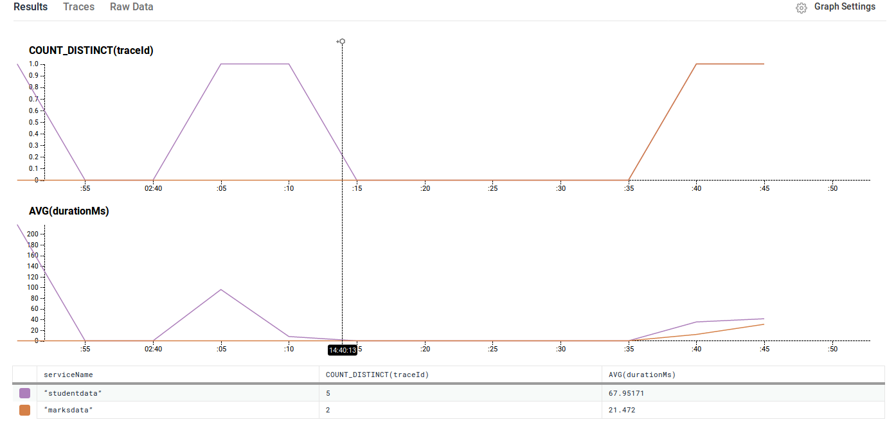
   
   
###### Per resource
   This will include all self defined span as well when finding the number of requests per resource wit average response time.
   Set the time period to 1 minute as instructed above.
   
                Query parameters use for each category:-
            
                          1. BREAK DOWN - name
                          2. CALCULATE PER GROUP - COUNT_DISTINCT(traceId), AVG(durationMs)
                          3. FILTER - name does-not-start-with ballerina/ 
                          4. LIMIT - 100 
                          
                      We filter out the other default ballerina resource using the filter query.
                          
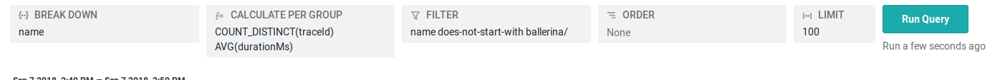
                            
  The result of the above query is as follows : -
                 
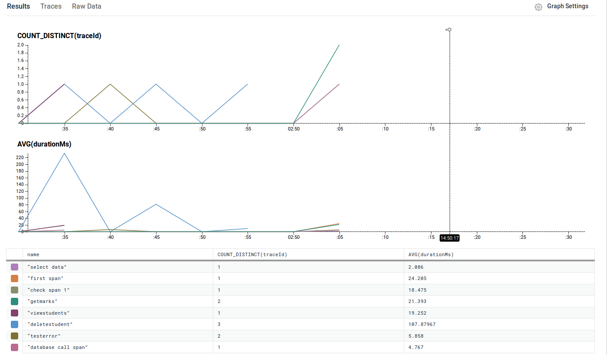
  
  
#### Last 5 minutes summary
        
###### Per service
       
   To find the total request count per service with average response time for the last 5 minutes :-
  > Duration can be set on the top right corner of the query builder. You can customize the 
   time period within which you wanted to get the metrics.
        
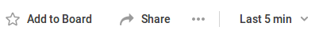
     
   By the drop down menu you can customize the time period.
            
                   Query parameters use for each category:-
                   
                          1. BREAK DOWN - serviceName
                          2. CALCULATE PER GROUP - AVG(durationMs), COUNT_DISTINCT(traceId)
                          3. FILTER - name does-not-start-with ballerina/     
                   
                         We filter out the other default ballerina resource using the filter query.
                             
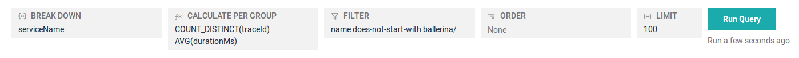
                             
   The result of the above query is as follows : -
                  
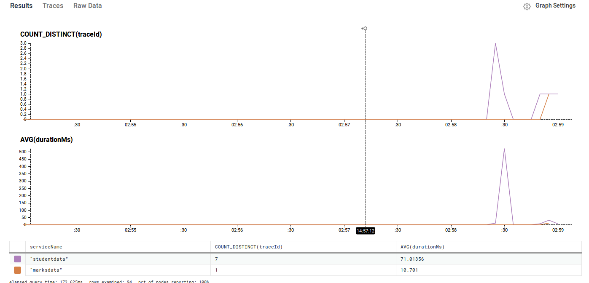
     
     
###### Per resource
   This will include all self defined span as well.
   Set the time period to 5 minutes as instructed above.
     
                  Query parameters use for each category:-
              
                         1. BREAK DOWN - name
                         2. CALCULATE PER GROUP - COUNT_DISTINCT(traceId), AVG(durationMs)
                         3. FILTER - name does-not-start-with ballerina/ 
                         4. LIMIT - 100 
                         
                       We filter out the other default ballerina resource using the filter query.
                            
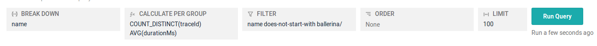
                              
   The result of the above query is as follows : -
                   
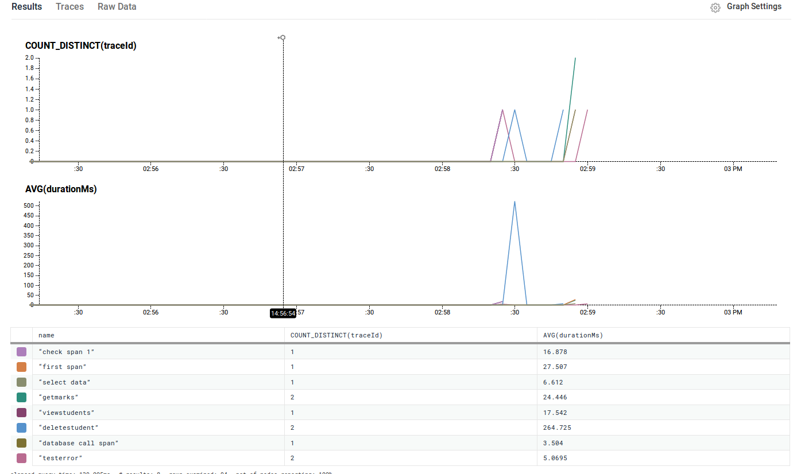
   
   
   
#### Last 1 hour summary
           
###### Per service
          
   To find the total request count per service with average response time for the last 1 hour :-
  > Duration can be set on the top right corner of the query builder. You can customize the 
   time period within which you wanted to get the metrics.
           
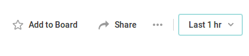
        
   By the drop down menu you can customize the time period.
               
                  Query parameters use for each category:-
                      
                          1. BREAK DOWN - serviceName
                          2. CALCULATE PER GROUP - AVG(durationMs), COUNT_DISTINCT(traceId)
                          3. FILTER - name does-not-start-with ballerina/   
                          
                            
                      We filter out the other default ballerina resource using the filter query. 
                                
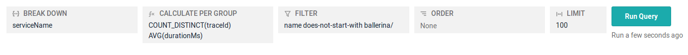
                                
   The result of the above query is as follows : -
                     

        
        
###### Per resource
   This will include all self defined span as well.
   Set the time period to 1 hour as instructed above.
        
                  Query parameters use for each category:-
                 
                          1. BREAK DOWN - name
                          2. CALCULATE PER GROUP - COUNT_DISTINCT(traceId), AVG(durationMs)
                          3. FILTER - name does-not-start-with ballerina/ 
                          4. LIMIT - 100 
                          
                       We filter out the other default ballerina resource using the filter query.
                               
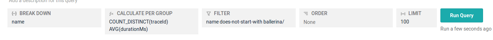
                                 
   The result of the above query is as follows : -
                     
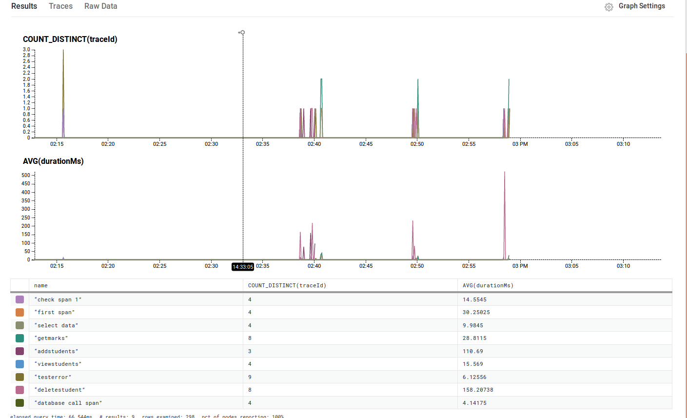

##### Honeycomb UI Boards
   
   These queries can be predefined and added to the board so that the live observability can be achieved without building queries multiple times. 
   
   To add a query to a board : -
      
   - Create a board.  You can create a board when you run a query. You will see an option “Add to Board” above the query builder.
   
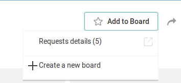 
   
     
   -  After creating a board select the board. In this guide a board “Requests details” has been already created. Give a name for your query ,add description to be more clear and save the query
    
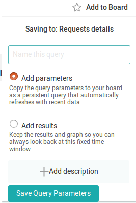 
   
   - You can view your boards by clicking the “My Boards” in the team’s main menu in honeycomb UI.

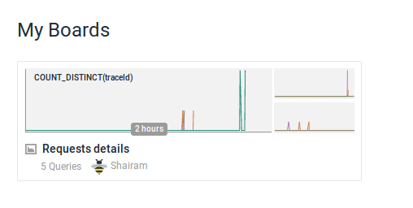

   
   -  You can click on any of the boards and run the query for that particular instant.
   
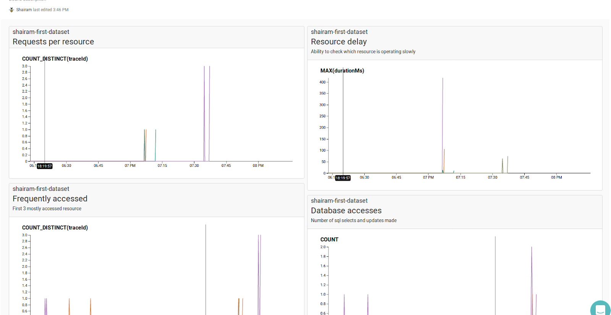

      
## About Honeycomb
The observability is being achieved by sending traces to the honeycomb UI, in which various queries are executed in order to analyse various conditions where the service is being used by the clients. 
 
 Traces refers to the series of the flow of events that occurs when a request is being made and a response is given back. 
 
 
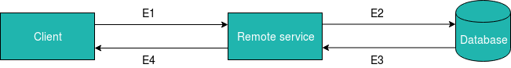


For example a client requesting data from the database as above.
E refers to an event.
A trace is the path from E1 to E4.

Traces are further broken down into spans. 
Spans can be defined as a single operation, i.e server requesting from database to obtain data and receiving it (E2+E3). 
Spans contain data which can be used for interpreting the performance.

These traces contains metadata (span data) which can be captured by honeycomb and be shown graphically or in raw data.


#### Honeycomb open-tracing proxy

Honeycomb works with the data collected in Zipkin format. This proxy will run in your local machine and collects the zipkin formatted trace data and sends to honeycomb. 

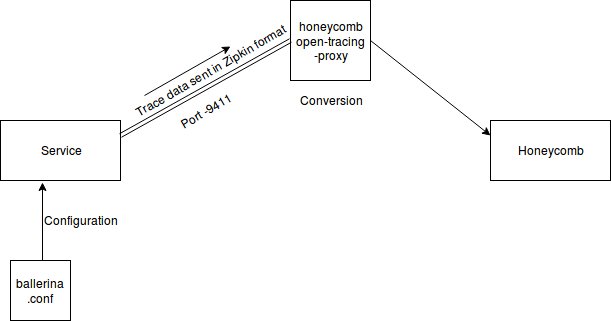
